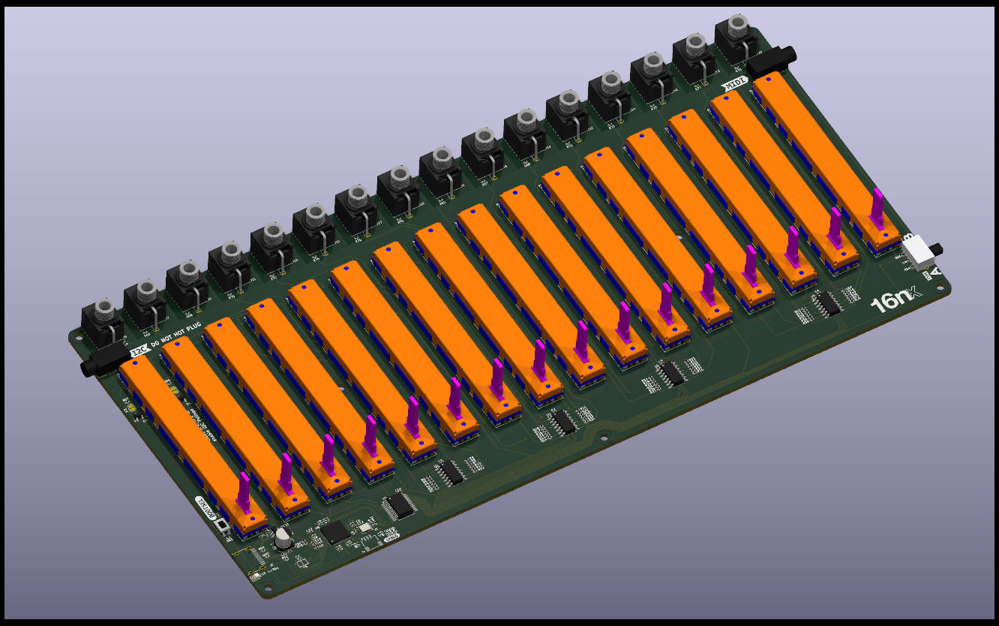

# 16nx

_Here's a nice render of the 16nx main board_

16nx is an open-source controller for electronic musical instruments and devices. 16 60mm faders let you control devices over MIDI, CV, and I2C.

16nx represents a 'second generation' 16n. It has exactly the same functionality as the original 16n faderbank; however, the hardware has been completely redesigned - primarily to make it **possible to build again**. The Teensy 3.2 at the heart of 16n is end-of-life, and it didn't make any more sense to build the board around it.

If you already have a 16n that works: you will gain nothing by upgrading. If, however, you're looking to acquire a faderbank in 2024+, then 16nx is your best route to do so.

The hardware and software projects are now decoupled, and are in separate repositories.

## Hardware design goals

The hardware design goals are based on making the board 'more manufacturable', whilst also bringing the overall BOM cost of the board down a little. As described in the project README, the goals were:

- replace Teensy 3.2 board with RP2040 microcontroller and supporting circuitry, directly on the board. No more daughterboards/modules!
- move to USB-C connector.
- add more power filtering onto 5V line.
- redesign analog circuitry for CV outs. Rather than running the faders at 5V and dividing down to ~3.2V for the microcontroller, 16nx runs at 3.3V everywhere, and amplifies fader values _up_ to ~5V via the MCP6004 op-amps.
- move to vertical Thonkiconn jacks for CV outputs (cheaper, easier to physically access for users, easier to purchase).
- move to new horizontal jack parts for MIDI/I2C, ensuring there are no connectors on front panel (4332.2330 Schurter jacks). All connections to the board are on the left/right sides or top; the front and back are empty. This makes using it flush against other objects easier, and makes using the board in its rotated operation easier.
- assume all surface-mount componentry will be machine-placed; passives are now down to 0402, various QFN/USON parts that should be reflowed.
- move to KiCad for design files.

Since 16n was produced, the quality and accessibility of PCBA (automated assembly) for end-users and hobbyists is much improved. 16nx assumes all surface mount will be assembled directly onto the board by an assembling factory. The only manual assembly anticipated on the board is of the through-hole components: faders, jacks, switch. The product is designed around relatively generic, off-the-shelf parts available at eg [JLC][jlc].

Since 16n, EAGLE no longer feels like a suitable choice for a hobbyist/open source project. [KiCad][kicad] is an excellent ECAD tool, widely supported, and - like the 16n project - is open source. I'm happier using open-source tools and file formats for working on an open-source project, and so it's a good fit.

[You can find the hardware repository here.][hardware]

## Software design goals

Backwards compatibility. That's it. The 16nx is compatible with the 16n editor, and that's how you edit it. It still speaks monome-style I2C protocols, USB and TRS MIDI.

New firmware - which will be available, compiled, for every release - is easy to install; just hold down the BOOTSEL button, connect the hardware, and drag the new UF2 file to the disk that has mounted on your computer. The board will reboot with the latest firmware.

The firmware is currently written in C++ for the [Pico SDK][picosdk]. This uses a straightforward, open-source toolchain (`cmake` and `arm-none-eabi-gcc`) to compile.

[You can find the software repository here.][software]

## Remind me, what does it do?

You move faders. 16nx emits output.

It has a number of outputs:

- it sends **MIDI data over USB**; by default, a different continuous controller for each fader.
- it sends **MIDI data over a 3.5mm stereo (TRS) jack**, which you can break out using any available converter. There is a switch to toggle between the two standards for this (so it’ll work with both Type A and Type B products and converters directly). This can be the same CCs as the MIDI over USB, or different ones, if you’d like.
- it sends **0-5V CV** out of sixteen jacks, one for each fader. (Well, almost 5V, dependent on your USB power supply)
- it sends data over **I2C**, using a TRS jack: either as a master device, which could connect directly to (e.g.) an ER-301 or monome Ansible, or as a bus device for a monome Teletype

All outputs are sent **simultaneously**.

## Making a 16nx

The repository for the electronics should have a "release" containing the latest gerber files for a board, along with CSV files for PCBA of BOM and component positioning. Gerbers are _not_ checked in to the repository: they're a compilation output, not raw data. DXF files for top/bottom panels, along with a mechanical drawing, are also included, as is a CSV BOM designed for human-reading with links to parts on JLC and Mouser.

That should be enough to order boards fabricated, and any extra parts you require. Given minimum order quantities are now around 5 from many PCBA houses, you might want to organise a group buy around boards and/or panels.

I imagine fabricated main boards will be available soon enough from assemblers or synth DIY shops.

A fabricated board just needs the through-hole parts adding, top/bottom panels adding with M2.5 stand-offs, and the UF2 firmware flashing, and you're good to go.

## Who’s making this?

Tom Armitage.

The history of the 16n is as a community project that emerges from the [Lines](https://llllllll.co) forum. [Brian Crabtree](https://nnnnnnnn.co) and [Sean Hellfritsch](http://coolmaritime.org) made the first version. [Tom Armitage](https://tomarmitage.com) redesigned the electronics, primarily adding CV and MIDI outs; Tom and [Brendon Cassidy](http://bpcmusic.com) extended the firmware; Brendon's contributions to the 16n I2C code must be noted in particular.

Tom is responsible for the 16nx hardware and firmware.

## Licensing

16nx remains open source: hardware is CC-BY-SA, firmware and editor are MIT license.

[jlc]: https://jlcpcb.com
[kicad]: https://kicad.org
[picosdk]: https://www.raspberrypi.com/documentation/pico-sdk/index_doxygen.html
[hardware]: https://github.com/16n-faderbank/16nx
[software]: https://github.com/16n-faderbank/16next_firmware
