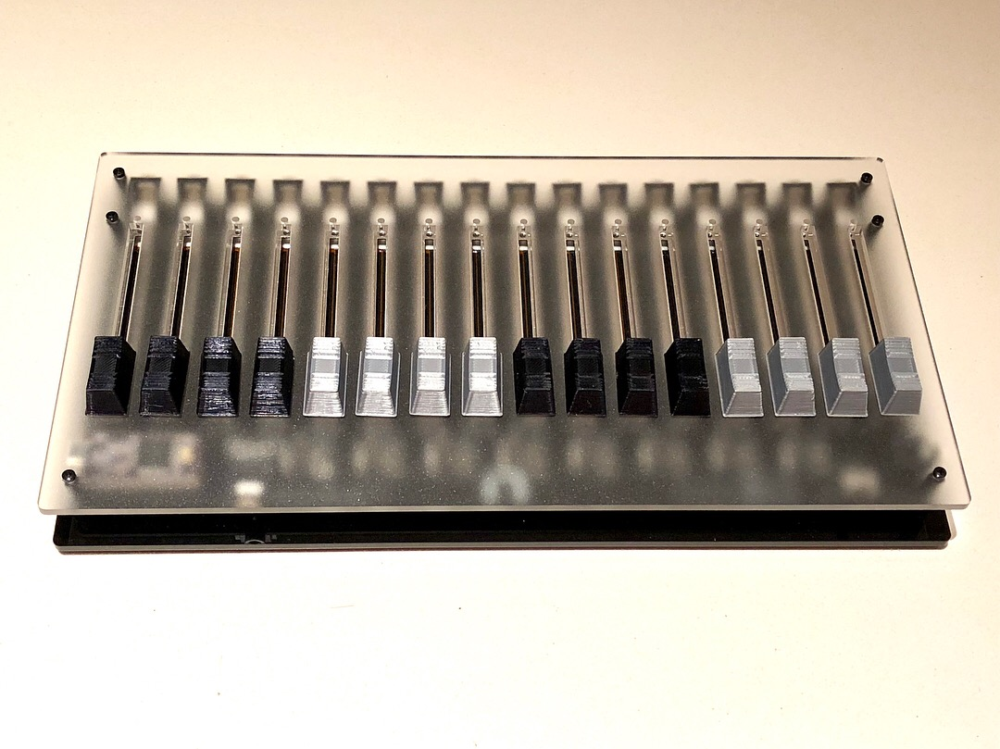
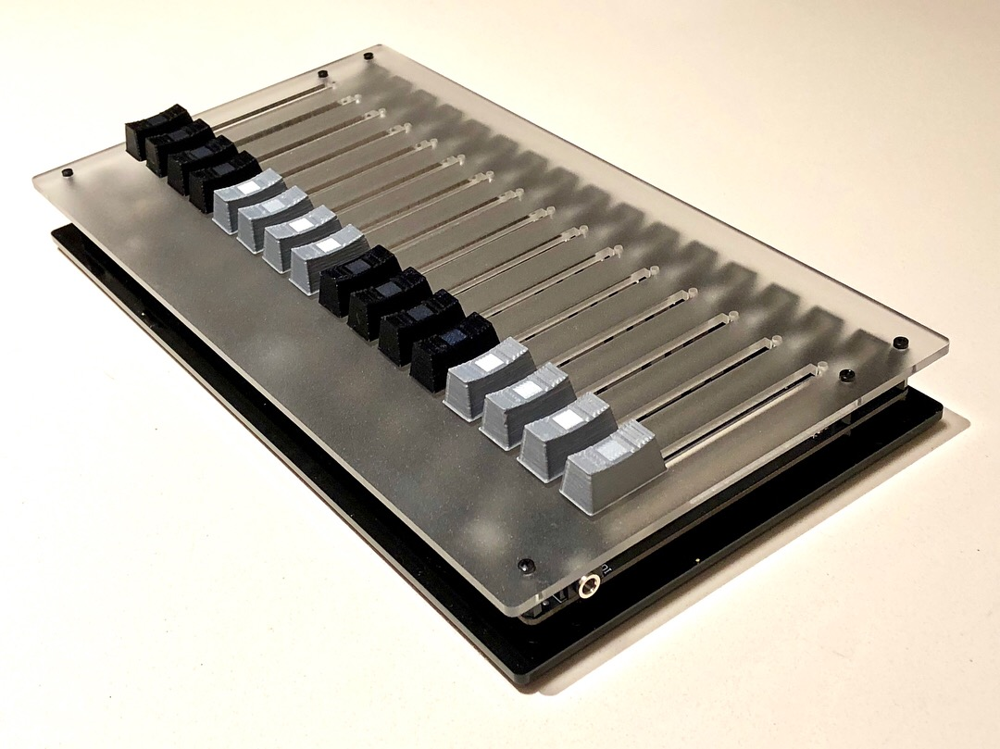

# 16n

_pictures by Brendon Cassidy_

## What is that thing?

This is 16n. It is a bank of 16 faders. It is designed for controlling electronic musical instruments and devices.

## What does it do?

You move faders on it. It emits output. 

It has a number of outputs:
* it sends MIDI data over USB; by default, a different continuous controller for each fader.
* it sends MIDI data over a 3.5mm stereo (TRS) jack, which you can break out using  any available converter. There is a switch to toggle between the two standards for this (so it’ll work with both Korg/Makenoise and Arturia/Novation products and converters directly). This can be the same CCs as the MIDI over USB, or different ones, if you’d like.
* it sends 0-5V CV out of sixteen jacks, one for each fader. (Well, almost 5V, dependent on your USB power supply)
* it sends data over I2C, using a TRS jack: either as a master device, which could connect directly to (e.g.) an ER-301 or monome Ansible, or as a bus device for a monome Teletype

All outputs are sent **simultaneously**.

16n is built around a Teensy microcontroller, and is written in Arduino-style C++; you can edit it all through the Arduino IDE. You can easily configure options via a config file, or write your own firmware, if you prefer.

16n is open source: the code is MIT licensed; the hardware is Creative Commons

## How do I get one?

Everything you need to make one can be found at [the github repository](TODO).

That contains schematics files, Gerber files, original EAGLE cad documents, CAD files for top/bottom panels, and the firmware code. It contains links to BOMs and a concise build guide.

If that sounds like gibberish to you, you might want to try to find a friendly music-DIY type to build one for you. Right now, the only way to get a 16n is to make it yourself.

## How much does it cost?

The bill of materials varies depending on how many you're making at once. The circuit boards work out at around \$240 for 3 from OSHPark, but can go down to around \$50 for 5 from Chinese manufacturers. Including plastic panels, fader caps, and so on, you should be able to build one for under $200.

## Can you give me some examples of what people are doing with it?

Yes.

<iframe width="560" height="315" src="https://www.youtube.com/embed/gEjbc87Cu9c" frameborder="0" allow="autoplay; encrypted-media" allowfullscreen></iframe>

<blockquote class="instagram-media" data-instgrm-captioned data-instgrm-permalink="https://www.instagram.com/p/BhU-AfnAmHB/" data-instgrm-version="8" style=" background:#FFF; border:0; border-radius:3px; box-shadow:0 0 1px 0 rgba(0,0,0,0.5),0 1px 10px 0 rgba(0,0,0,0.15); margin: 1px; max-width:658px; padding:0; width:99.375%; width:-webkit-calc(100% - 2px); width:calc(100% - 2px);">
 
 

 
 <a href="https://www.instagram.com/p/BhU-AfnAmHB/" style=" color:#000; font-family:Arial,sans-serif; font-size:14px; font-style:normal; font-weight:normal; line-height:17px; text-decoration:none; word-wrap:break-word;" target="_blank">16n fader bank controlling the ER301 directly via i2c communication || all sounds ER301 || personally I feel this is where music making is headed, a hybrid playground between the old &amp; new, exciting times 🙌 - . . #16n #er301 #orthogonaldevices #eurorack #modularsynth #teensy #arduino #synth #electronicmusic #music #sound #fm #fmsynthesis #glitch</a>
 
A post shared by <a href="https://www.instagram.com/tomhallsonics/" style=" color:#c9c8cd; font-family:Arial,sans-serif; font-size:14px; font-style:normal; font-weight:normal; line-height:17px;" target="_blank"> Tom Hall</a> (@tomhallsonics) on <time style=" font-family:Arial,sans-serif; font-size:14px; line-height:17px;" datetime="2018-04-08T23:22:44+00:00">Apr 8, 2018 at 4:22pm PDT</time>

</blockquote> 

<iframe width="560" height="315" src="https://www.youtube.com/embed/gaxW51dK7Dk?rel=0" frameborder="0" allow="autoplay; encrypted-media" allowfullscreen></iframe>

## Who's making this?

So far: Brian Crabtree, Sean Hellfritsch, Tom Armitage, Brendon Cassidy.

This is a community project that emerges from the [Lines](https://llllllll.co) forum. [Brian Crabtree](https://nnnnnnnn.co) and [Sean Hellfritsch](http://coolmaritime.org) made the first version. [Tom Armitage](https://tomarmitage.com) redesigned the electronics, primarily adding CV and MIDI outs; Tom and [Brendon Cassidy](http://bpcmusic.com) extended the firmware; Brendon's contributions to the I2C code must be noted in particular.

## Where can I find out more?

There's not a mailing list or anything. There is, however, [this sprawling thread on lines](https://llllllll.co/t/interest-check-faderbank-run/9920), where you can follow the story so far.

