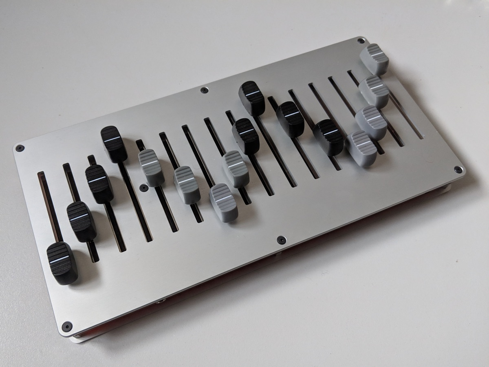

# 16n

_picture by Tom Armitage_

## UPDATE: v2.0.1 is out now!

> Firmware v2 makes it easier than ever to configure your 16n. [Find out more at the lines thread](https://llllllll.co/t/16n-firmware-2-0-0-release-and-official-thread/30976). Upgrading to Firmware v2.0.0 can be done from any computer you can install Teensy Loader on. Full instructions are [on the wiki](https://github.com/16n-faderbank/16n/wiki/Firmware:-installation-instructions). And the firmware release [can be found here](https://github.com/16n-faderbank/16n/releases/tag/v2.0.1)

## What is that thing?

This is 16n. It is a bank of 16 60mm faders. It is designed for controlling electronic musical instruments and devices. Everything you need to make one is at [its Github repository.](https://github.com/16n-faderbank/16n)

## What does it do?

You move faders. 16n emits output. 

It has a number of outputs:
* it sends **MIDI data over USB**; by default, a different continuous controller for each fader.
* it sends **MIDI data over a 3.5mm stereo (TRS) jack**, which you can break out using any available converter. There is a switch to toggle between the two standards for this (so it’ll work with both Korg/Makenoise and Arturia/Novation products and converters directly). This can be the same CCs as the MIDI over USB, or different ones, if you’d like.
* it sends **0-5V CV** out of sixteen jacks, one for each fader. (Well, almost 5V, dependent on your USB power supply)
* it sends data over **I2C**, using a TRS jack: either as a master device, which could connect directly to (e.g.) an ER-301 or monome Ansible, or as a bus device for a monome Teletype

All outputs are sent **simultaneously**.

16n is built around a Teensy microcontroller, and is written in Arduino-style C++.

As of version 2.0.0, you can configure your 16n through a web-based UI. Here it is in action:

<iframe width="560" height="315" src="https://www.youtube.com/embed/3n2_3b55qWY" frameborder="0" allow="accelerometer; autoplay; encrypted-media; gyroscope; picture-in-picture" allowfullscreen></iframe>

16n is **entirely open source**: the code is MIT licensed; the hardware is Creative Commons. You're free to make derivatives, or hack on the firmware yourself.

The user guide is on the [Github wiki for the project](https://github.com/16n-faderbank/16n/wiki), which is the primary source of documentation.

## Can you give me some examples of what people are doing with it?

Yes.

<iframe width="560" height="315" src="https://www.youtube.com/embed/edriUxDgTsg" frameborder="0" allow="autoplay; encrypted-media" allowfullscreen></iframe>

<iframe width="560" height="315" src="https://www.youtube.com/embed/gEjbc87Cu9c" frameborder="0" allow="autoplay; encrypted-media" allowfullscreen></iframe>

<blockquote class="instagram-media" data-instgrm-captioned data-instgrm-permalink="https://www.instagram.com/p/BhU-AfnAmHB/" data-instgrm-version="8" style=" background:#FFF; border:0; border-radius:3px; box-shadow:0 0 1px 0 rgba(0,0,0,0.5),0 1px 10px 0 rgba(0,0,0,0.15); margin: 1px; max-width:658px; padding:0; width:99.375%; width:-webkit-calc(100% - 2px); width:calc(100% - 2px);">
 
 

 
 <a href="https://www.instagram.com/p/BhU-AfnAmHB/" style=" color:#000; font-family:Arial,sans-serif; font-size:14px; font-style:normal; font-weight:normal; line-height:17px; text-decoration:none; word-wrap:break-word;" target="_blank">16n fader bank controlling the ER301 directly via i2c communication || all sounds ER301 || personally I feel this is where music making is headed, a hybrid playground between the old &amp; new, exciting times 🙌 - . . #16n #er301 #orthogonaldevices #eurorack #modularsynth #teensy #arduino #synth #electronicmusic #music #sound #fm #fmsynthesis #glitch</a>
 
A post shared by <a href="https://www.instagram.com/tomhallsonics/" style=" color:#c9c8cd; font-family:Arial,sans-serif; font-size:14px; font-style:normal; font-weight:normal; line-height:17px;" target="_blank"> Tom Hall</a> (@tomhallsonics) on <time style=" font-family:Arial,sans-serif; font-size:14px; line-height:17px;" datetime="2018-04-08T23:22:44+00:00">Apr 8, 2018 at 4:22pm PDT</time>

</blockquote> 

<iframe width="560" height="315" src="https://www.youtube.com/embed/gaxW51dK7Dk?rel=0" frameborder="0" allow="autoplay; encrypted-media" allowfullscreen></iframe>

And, I _think_, that is one that Richie Hawtin has:

<iframe src="https://www.facebook.com/plugins/post.php?href=https%3A%2F%2Fwww.facebook.com%2Frichiehawtin%2Fposts%2F10162243179820074%3A0&width=500" width="500" height="689" style="border:none;overflow:hidden" scrolling="no" frameborder="0" allowTransparency="true" allow="encrypted-media"></iframe>

## How do I get one?

Right now: you make one yourself. Everything you need to make one can be found at [the github repository](https://github.com/16n-faderbank/16n).

That means you'll need to:

- make PCBs for it. The repository includes [the original CAD files, and gerber files, to get PCBs manufactured.](https://github.com/16n-faderbank/16n/tree/master/electronics)
- source parts. The repository contains a Bill of Materials, and links to online parts.
- flash the Teensy microcontroller with the firmware, using Teensy Loader. [Here is how](https://github.com/16n-faderbank/16n/wiki/Firmware:-installation-instructions). Alternatively, [all the firmware source code is in the repository.](https://github.com/16n-faderbank/16n/tree/master/firmware/_16n_faderbank_firmware)
- assemble the board. The documentation contains [instructions to build it.](https://github.com/16n-faderbank/16n/wiki/Build-guide)
- make a panel for it. The repository contains [CAD files for the top/bottom panels](https://github.com/16n-faderbank/16n/tree/master/panel), so you can, for instance, lasercut your own.

Everything is entirely open source. If you know what an "Ornament and Crime" synth module is: this project is similar in terms of how much is done for you, and how much you have to do. And of course, you're be able to make your own modifications and customisations.

If that sounds like gibberish to you, you might want to try to find a friendly music-DIY type to build one for you. Right now, the only way to get a 16n is to make it yourself.

There may be other options in the future.

## How much does it cost?

"It depends".

The bill of materials varies depending on how many you're making at once. For instance, the circuit boards work out at around \$240 for 3 from OSHPark, but can go down to around \$50 for 5 from Chinese manufacturers. The 60mm Alps faders come down substantially in price when you buy them in bulk. And the panel price will vary depending on how you make it - lasercut plastic or ply will be very different to metal, for instance.

## I have some problems with my 16n

Sorry to hear that. 16n is an open-source product, so there's limited capacity for us to support it. But: you should raise an [Issue on the 16n github](https://github.com/16n-faderbank/16n/issues). That way the community can also see the issue, and we can see if we can get it resolved. Note that 16n is open source; support is offered entirely on a voluntary basis.

## I'd like to test my 16n

The [editor](/editor) will let you see all USB faders in motion, and let you reconfigure it.

If you're running firmware 1.34 or earlier, you can use [the browser test page](/16ntest.html) in Google Chrome to test the USB-MIDI output - useful for quick debugging.

## I have ideas for changes / an improvement I wish to share / a version I wish to make

Awesome.

If you have an idea for a change... perhaps raise it as an Issue with a 'suggestion' label?

If you have an improvement you wish to share, [a Pull Request against the main repository](https://github.com/16n-faderbank/16n/pulls) would be ideal; we'll see if we can't fold it in somehow.

If you have your own version: that's awesome. Remember that the hardware is licensed CC-BY-SA, so you must correctly credit everyone involved in the initial version, and also share your own changes with the similar license. So you can't make a fork of 16n that you don't open-source yourself.

## Who's making this?

So far: Brian Crabtree, Sean Hellfritsch, Tom Armitage, Brendon Cassidy.

This is a community project that emerges from the [Lines](https://llllllll.co) forum. [Brian Crabtree](https://nnnnnnnn.co) and [Sean Hellfritsch](http://coolmaritime.org) made the first version. [Tom Armitage](https://tomarmitage.com) redesigned the electronics, primarily adding CV and MIDI outs; Tom and [Brendon Cassidy](http://bpcmusic.com) extended the firmware; Brendon's contributions to the I2C code must be noted in particular.

## Where can I find out more?

There's not a mailing list or anything. There is, however, [this thread on lines](https://llllllll.co/t/16n-is-a-bank-of-faders-release-thread-current-version-1-31/18620/3) to support the official release. And there's also [this sprawling thread on lines](https://llllllll.co/t/interest-check-faderbank-run/9920), where you can follow the story of its creation.

## Talking about 16n

I recommend `#16nfaderbank` as hashtag for talking about 16n, for _reasons_. (The more obvious hashtag already appears to have less savoury connotations.)